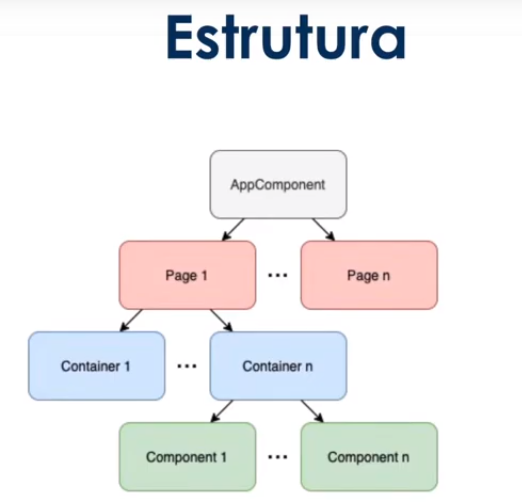

## Padrão Container vs Presenter

- Separa nossos components entre containers e presenters
- Permite utilizar o change detection a nosso favor
- Separa responsabilidade
- Permite escrever componentes mais facilmente reutilizaveis

### Presenter

- Preocupa-se em como as coisas são mostradas
- Recebe informação do componente via Input
- Emite eventos para o componente pai via Output
- Não guardam estado
- Podem ter presenters e containers dentro deles
- Podem ser mais performáticos com OnPush

### Container

- Preocupa-se em como as coisas funcionam
- Consomem e geram informação de serviços
- Disparam ações com base nos eventos do componente filho
- Tem noção do estado
- Podem ter presenters ou containers dentro deles

### Estrutura

### Some questions:

1. O que não é comum de um componente do tipo container fazer?
    - Lidar com uma grande quantidade de eventos vindos de componentes filho distintos.
2. Qual o ponto negativo de alterar manualmente o comportamento do change detection dentro de um componente?
    - Quanto maior o componente e sua árvore de componentes filhos, mais difícil é lidar com os eventos que marcam o componente para ser verificado e que removem ele da execução.
3. Considerando a estrutura abordada no vídeo, o que são páginas?
    - Feature modules que são renderizados no router-outlet raiz da aplicação.
4. Qual a consequência de remover um componente da árvore de change detection?
    - A view não é atualizada.
5. O que não é comum de um componente do tipo presenter fazer?
    - Se comunicar diretamente com serviços.
6. Qual a vantagem de utilizar OnPush como estratégia de change detection?
    - Faz o change detection rodar apenas quando a referência de um Input é atualizada, ótimo para componentes do tipo presenter.