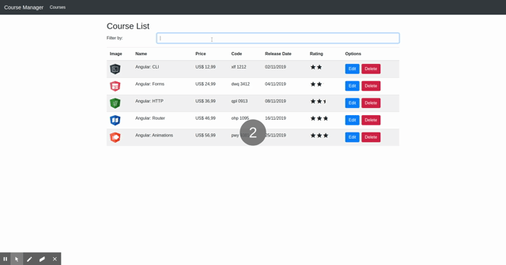

## Course manager

Project inspired by [DIO course angular](https://web.digitalinnovation.one/course/introducao-ao-angular-8/learning/393710c5-fdf4-4564-a895-bba983417769)

In this project is used:

- Typescript;
- Nodejs;
- Angular 9;

<h2 align="center">Course Manager layout</h2>

    

## Running

- `npm install` install all dependencies
- `npm start` run application
