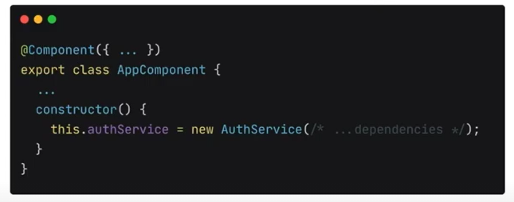
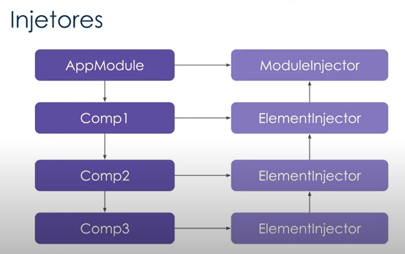
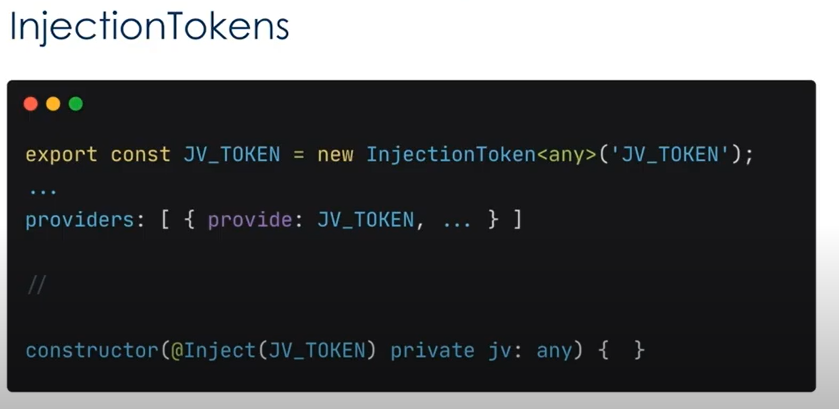
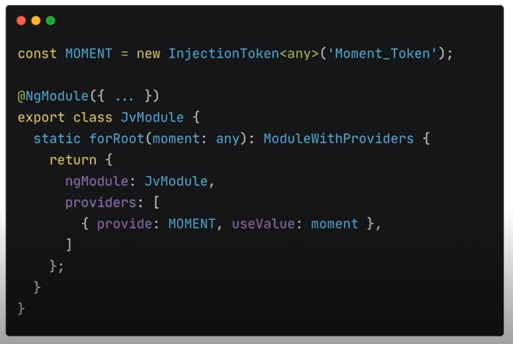

## Dependency injection

- Design pattern;
- Dependencies are services or objects that a class needs to perform some action;
- With dependency injection, a class "asks" for a dependency on an external provider to manually instantiate.

### Problems:



- Each component with one different instance;
- Hard to create mocks for test.

### Injectors

- Source responsible for keeping the structure key/value of providers;
- Instantiate classes and inject the instance in components when they request;
- Works in a hierarchical way.

#### Types of injectors



#### Tokens

- Need exist on runtime
  - Cannot be primitive types, interfaces, functions, etc.
- In most cases tokens are classes

##### Injection Tokens



### Providers

- Define a value for a token;
- Usually instantiating a class;
- We can define a literal value with

```
  {
    provide: TestService,
    useValue: {
      myFunction: () => {}
    }
  }
```

- We can use two tokens with different instances of the same class, this way:

```
  providers: [
    AuthService,
    { provide: MyAuthService, useClass: AuthService }
  ]
```

- useFactory way:

```
  providers: [
    {
      provide: AuthService,
      useFactory: (userContext: UserContext) => new AuthService(userContext),
      deps: [UserContext]
    }
  ]
```

With `deps` propertie we define de dependencie of the factory for instantiate the AuthService

### ModuleWithProviders

- Wrapper outside of the NgModule link with providers;
- Function normally static, inside of module of accepting params;
- Need return one object immediately


